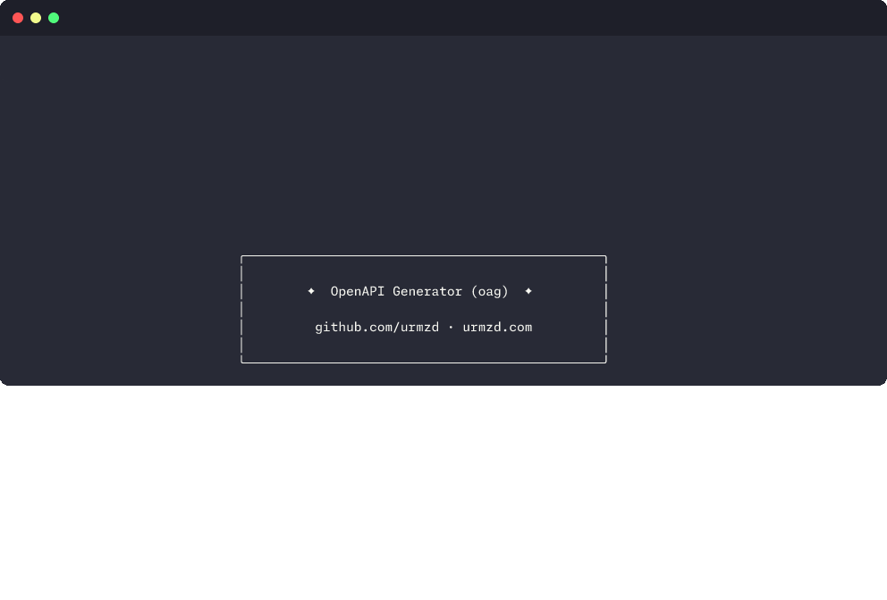

<p align="center">
  <h1 align="center">oag</h1>
  <p align="center">
    OpenAPI 3.x code generator with a plugin-style architecture supporting TypeScript, React, and Python FastAPI.
    <br /><br />
    <a href="https://github.com/urmzd/oag/releases">Download</a>
    &middot;
    <a href="https://github.com/urmzd/oag/issues">Report Bug</a>
    &middot;
    <a href="https://github.com/urmzd/oag/tree/main/examples">Examples</a>
  </p>
</p>

<p align="center">
  <a href="https://github.com/urmzd/oag/actions/workflows/ci.yml"></a>
</p>



## Why oag?

OpenAPI 3.2 shipped but most generators haven't caught up. When you need to glue a frontend to a backend during a POC, you don't want to fight a generator that produces bloated code requiring heavy post-processing.

`oag` focuses on simplicity: one config file, one command, clean output.

- Parses OpenAPI 3.x specs with full `$ref` resolution
- Plugin-style architecture: enable only the generators you need
- **TypeScript/Node client** with zero runtime dependencies
- **React/SWR hooks** for queries, mutations, and SSE streaming
- **Python FastAPI server** with Pydantic v2 models
- First-class Server-Sent Events support via `AsyncGenerator` (TS) and `StreamingResponse` (Python)
- **Test generation** — pytest tests for FastAPI, vitest tests for TypeScript/React (opt-out via `scaffold.test_runner: false`)
- Scaffolds Biome + tsdown configuration for TypeScript projects, Ruff for Python
- Configurable naming strategies and operation aliases
- Three layout modes per generator: bundled, modular, or split

## Quick start

Install with a single command (Linux/macOS):

```sh
curl -fsSL https://raw.githubusercontent.com/urmzd/oag/main/install.sh | sh
```

Or install from crates.io (requires Rust):

```sh
cargo install oag-cli
```

Windows users can download binaries directly from the
[latest release](https://github.com/urmzd/oag/releases/latest).

<details>
<summary>Build from source</summary>

```sh
git clone https://github.com/urmzd/oag.git
cd openapi-generator
cargo install --path crates/oag-cli
```

</details>

Initialize a config file:

```sh
oag init
```

This creates `oag.yaml` in the current directory:

<!-- embed-src src="crates/oag-core/default-config.yaml" fence="yaml" -->
```yaml
# oag configuration — https://github.com/urmzd/oag
#
# This file is loaded automatically from the current directory when running `oag generate`.
# You can override the input spec with: oag generate -i other-spec.yaml
#
# Full reference: https://github.com/urmzd/oag#configuration

# ---------------------------------------------------------------------------
# Input
# ---------------------------------------------------------------------------
# Path to your OpenAPI 3.x spec (YAML or JSON), relative to this config file.
input: openapi.yaml

# ---------------------------------------------------------------------------
# Naming
# ---------------------------------------------------------------------------
# Controls how operation names (function/method names) are derived.
naming:
  # Strategy for deriving operation names:
  #   use_operation_id  — use the operationId field from the spec (default)
  #   use_route_based   — derive from HTTP method + path (e.g., GET /pets → getPets)
  strategy: use_operation_id

  # Custom aliases to rename specific operations. Applied after the naming strategy.
  # Keys are the resolved operation name, values are the desired alias.
  aliases: {}
    # createChatCompletion: chat     # operationId → custom name
    # listModels: models

# ---------------------------------------------------------------------------
# Generators
# ---------------------------------------------------------------------------
# Each key is a generator ID. Only generators listed here will run.
# Available generators:
#   node-client       — TypeScript/Node API client (zero runtime dependencies)
#   react-swr-client  — React/SWR hooks (extends node-client with hooks + context provider)
#   fastapi-server    — Python FastAPI server stubs with Pydantic v2 models
generators:
  node-client:
    # Directory where generated files are written. Created automatically.
    output: src/generated/node

    # How files are organized:
    #   bundled  — single file (src/index.ts)
    #   modular  — separate files per concern: types.ts, client.ts, sse.ts, index.ts (default)
    #   split    — separate files per operation group (see split_by)
    layout: modular

    # Only used with layout: split. Controls how operations are grouped into files:
    #   tag        — one file per OpenAPI tag (default)
    #   operation  — one file per operation
    #   route      — one file per route prefix
    # split_by: tag

    # Override the API base URL instead of reading from the spec's servers array.
    # Useful when the spec omits a server or you need a different URL for development.
    # base_url: https://api.example.com

    # Set to true to disable JSDoc comments on generated types and methods.
    # no_jsdoc: false

    # Subdirectory within output for generated source files.
    # Scaffold files (package.json, tsconfig, etc.) always stay at the output root.
    # Set to "" to place source files directly at the output root.
    # source_dir: src

    # Set scaffold to false to disable all scaffolding (for existing projects).
    # scaffold: false
    #
    # Scaffold controls which project configuration files are generated alongside
    # the source code. Set individual tools to false to disable them.
    scaffold:
      # NPM package name. Defaults to a slugified version of the spec's info.title.
      # package_name: my-api-client

      # Repository URL included in package.json.
      # repository: https://github.com/you/your-repo

      # Set to true to skip scaffold files (package.json, tsconfig, biome, tsdown)
      # but still emit a root index.ts re-export. Useful when adding generated code
      # to an existing project with its own build configuration.
      # existing_repo: false

      # Code formatter. Generates biome.json and auto-formats after generation.
      # Set to false to disable.
      formatter: biome        # biome | false

      # Test runner. Generates vitest test files and adds vitest to package.json.
      # Set to false to disable test generation.
      test_runner: vitest     # vitest | false

      # Bundler. Generates tsdown.config.ts for building distributable packages.
      # Set to false to disable.
      bundler: tsdown         # tsdown | false

  # react-swr-client:
  #   output: src/generated/react
  #   layout: modular           # only modular is supported for react-swr-client
  #   # base_url: https://api.example.com
  #   # no_jsdoc: false
  #   # source_dir: src
  #   scaffold:
  #     # package_name: my-react-client
  #     formatter: biome        # biome | false
  #     test_runner: vitest     # vitest | false
  #     bundler: tsdown         # tsdown | false

  # fastapi-server:
  #   output: src/generated/server
  #   layout: modular           # only modular is supported for fastapi-server
  #   scaffold:
  #     # package_name: my_api_server
  #     formatter: ruff         # ruff | false — auto-formats and lints after generation
  #     test_runner: pytest     # pytest | false — generates pytest tests with async httpx client
```
<!-- /embed-src -->

Generate code:

```sh
oag generate
```

This will generate code for all configured generators. You can override the input spec:

```sh
oag generate -i other-spec.yaml
```

**Note**: The old config format (with `target`, `output`, `output_options`, and `client` fields) is still supported for backward compatibility and automatically converted.

## CLI reference

| Command | Description | Key flags |
|---------|-------------|-----------|
| `oag generate` | Generate code from an OpenAPI spec | `-i, --input <PATH>` — override spec path |
| `oag validate` | Validate an OpenAPI spec and report its contents | `-i, --input <PATH>` **(required)** |
| `oag inspect` | Dump the parsed intermediate representation | `-i, --input <PATH>` **(required)**, `--format yaml\|json` |
| `oag init` | Create a `oag.yaml` config file | `--force` — overwrite existing |
| `oag completions` | Generate shell completions | `<SHELL>` — bash, zsh, fish, powershell, elvish |

Run `oag <command> --help` for detailed usage. Set `RUST_LOG=debug` for verbose output.

## Configuration

All options are set in `oag.yaml`. The CLI supports `-i/--input` to override the input spec path.

### Global options

| Key | Type | Default | Description |
|-----|------|---------|-------------|
| `input` | `string` | `openapi.yaml` | Path to the OpenAPI spec (YAML or JSON) |
| `naming.strategy` | `string` | `use_operation_id` | How to derive function names: `use_operation_id` or `use_route_based` |
| `naming.aliases` | `map` | `{}` | Map of operationId to custom name overrides |

### Generators

The `generators` map configures which generators to run and their options. Each generator has its own output directory and settings.

**Available generators:**
- `node-client` — TypeScript/Node API client (zero dependencies)
- `react-swr-client` — React/SWR hooks (extends node-client)
- `fastapi-server` — Python FastAPI server stubs with Pydantic v2 models

### Generator options (node-client, react-swr-client, fastapi-server)

| Key | Type | Default | Description |
|-----|------|---------|-------------|
| `output` | `string` | **required** | Output directory for this generator |
| `layout` | `string` | `modular` | Layout mode: `bundled` (single file), `modular` (separate files per concern), or `split` (separate files per operation group) |
| `split_by` | `string` | `tag` | Only for `split` layout: `operation`, `tag`, or `route` |
| `base_url` | `string` | *(from spec servers)* | Override the API base URL (TypeScript generators only) |
| `no_jsdoc` | `bool` | `false` | Disable JSDoc comments (TypeScript generators only) |
| `source_dir` | `string` | `"src"` | Subdirectory for generated source files — set to `""` to place files at the output root (TypeScript generators only) |
| `scaffold.package_name` | `string` | *(from spec title)* | Custom package name (TypeScript: npm, Python: pyproject.toml) |
| `scaffold.repository` | `string` | | Repository URL for package metadata |
| `scaffold.formatter` | `string` or `false` | `biome` (TS) / `ruff` (Python) | Code formatter — set to `false` to disable |
| `scaffold.test_runner` | `string` or `false` | `vitest` (TS) / `pytest` (Python) | Test runner — set to `false` to disable test generation |
| `scaffold.bundler` | `string` or `false` | `tsdown` | Bundler config (TypeScript only) — set to `false` to disable |
| `scaffold.existing_repo` | `bool` | `false` | Set to `true` to skip all scaffold files (package.json, tsconfig, biome, tsdown) and only emit a root `index.ts` re-export |

### Layout modes

- **bundled** — Everything in a single file (e.g., `src/index.ts` or `main.py`)
- **modular** — Separate files per concern (e.g., `src/types.ts`, `src/client.ts`, `src/sse.ts`, `src/index.ts`)
- **split** — Separate files per operation group (e.g., `src/pets.ts`, `src/users.ts`, `src/orders.ts`)

For TypeScript generators, source files are placed in a `src/` subdirectory by default (configurable via `source_dir`). This matches the scaffold's tsconfig.json (`rootDir`, `include`) and tsdown.config.ts (`entry`) — all of which adapt automatically to the configured `source_dir`. Set `source_dir: ""` to place files directly at the output root. Scaffold files (`package.json`, `tsconfig.json`, `biome.json`, `tsdown.config.ts`) always remain at the output root.

When using `split` layout, specify `split_by`:
- `operation` — One file per operation
- `tag` — One file per OpenAPI tag (default)
- `route` — One file per route prefix

### Backward compatibility

The old config format (with `target`, `output`, `output_options`, and `client` fields) is still supported and automatically converted to the new format.

## Agent Skill

This project ships an [Agent Skill](https://github.com/vercel-labs/skills) for use with Claude Code, Cursor, and other compatible agents.

**Install:**

```sh
npx skills add urmzd/oag
```

Once installed, use `/openapi-generate` to generate TypeScript clients, React/SWR hooks, or Python FastAPI servers from your OpenAPI spec.

## Architecture

```
oag-cli  -->  [oag-node-client, oag-react-swr-client, oag-fastapi-server]  -->  oag-core
```

The workspace uses a plugin-style architecture with five crates:

| Crate | Role |
|-------|------|
| [`oag-core`](crates/oag-core/) | OpenAPI parser, intermediate representation, transform pipeline, and `CodeGenerator` trait |
| [`oag-node-client`](crates/oag-node-client/) | TypeScript/Node API client generator (zero dependencies) |
| [`oag-react-swr-client`](crates/oag-react-swr-client/) | React/SWR hooks generator (extends node-client) |
| [`oag-fastapi-server`](crates/oag-fastapi-server/) | Python FastAPI server generator with Pydantic v2 models |
| [`oag-cli`](crates/oag-cli/) | Command-line interface that orchestrates all generators |

`oag-core` defines the `CodeGenerator` trait:

```rust
pub trait CodeGenerator {
    fn id(&self) -> config::GeneratorId;
    fn generate(
        &self,
        ir: &ir::IrSpec,
        config: &config::GeneratorConfig,
    ) -> Result<Vec<GeneratedFile>, GeneratorError>;
}
```

Each generator implements this trait with a unique ID (`node-client`, `react-swr-client`, or `fastapi-server`). The CLI loops over the configured generators in `oag.yaml` and invokes each one.

## Examples

Working examples with generated output are in the [`examples/`](examples/) directory:

- **[`petstore`](examples/petstore/)** — Node client and React client generated from the Petstore 3.2 spec
- **[`sse-chat`](examples/sse-chat/)** — Node client and React hooks with SSE streaming for a chat API

Each example has its own `oag.yaml` configuring generators with separate output directories (e.g. `generated/node` and `generated/react`).

Regenerate them with:

```sh
just examples
```